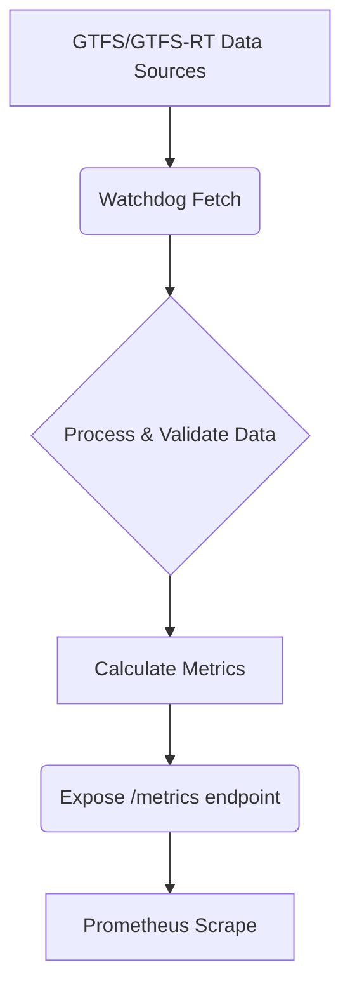
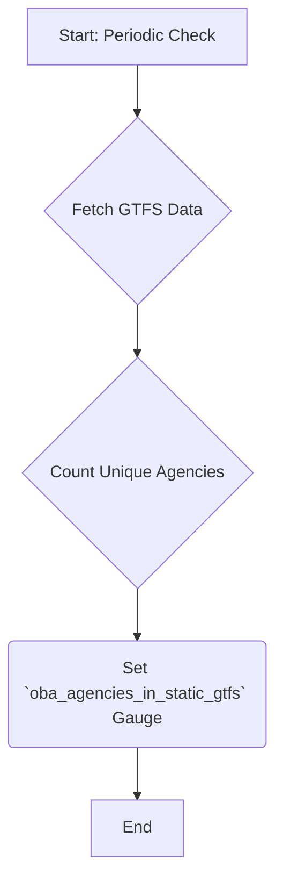
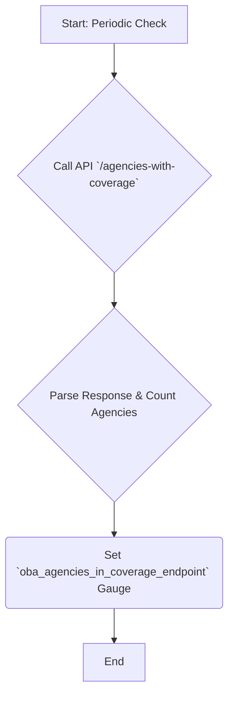
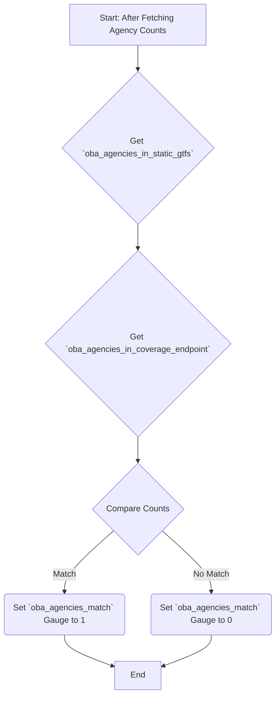
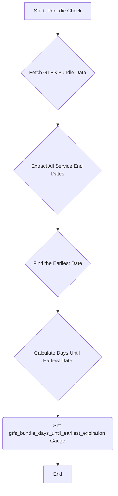
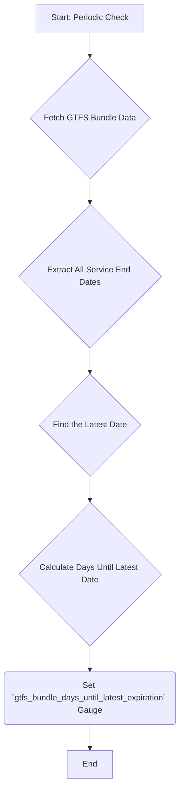
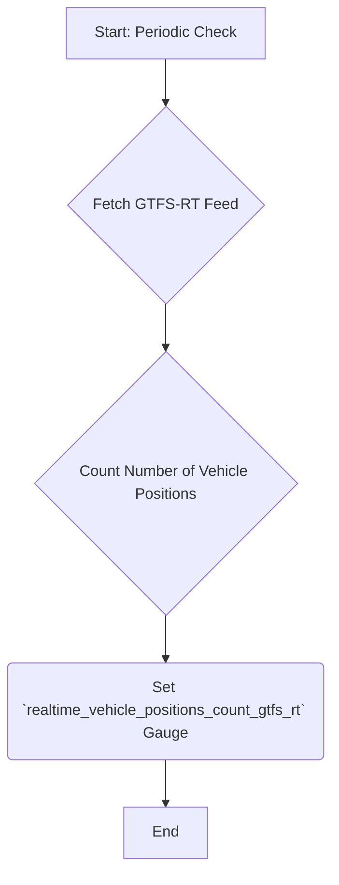
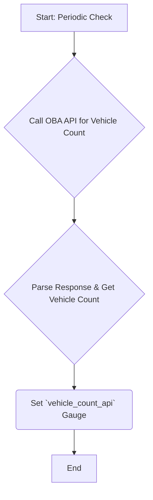
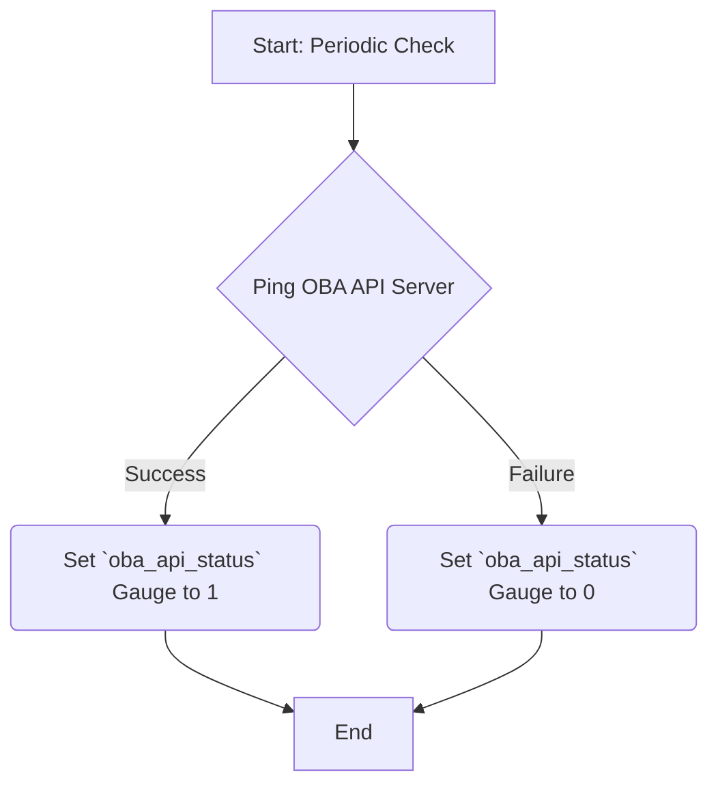

# Watchdog Metrics Reference Guide

**Version:** 1.0
**Date:** 2025-04-03

## 1. Introduction

This document serves as a comprehensive reference guide for the metrics system within the Go-based Watchdog project. Watchdog monitors the availability, data quality, and behavior of OneBusAway (OBA) servers, reporting metrics to a Prometheus server.

As an open-source project, understanding these metrics is essential for contributors aiming to monitor, debug, and enhance the system. Watchdog validates and monitors General Transit Feed Specification (GTFS) and GTFS-Realtime (GTFS-RT) feeds, ensuring transit data remains accurate, consistent, and available for downstream applications and end-users.

This guide details the currently implemented metrics, identifies areas for future expansion (particularly relevant for GSoC contributors aiming to replicate the broader metric scope of the original Watchdog), and provides guidelines for contributing new metrics.

## 2. Why Metrics Matter in Watchdog

Reliable and timely transit data is crucial for effective public transportation. Watchdog acts as a guardian for this data by focusing on several key areas, where metrics provide quantifiable insights:

1.  **Validating Data Consistency:** Ensuring agency information and vehicle counts align between static data (GTFS), real-time feeds (GTFS-RT), and API endpoints.
2.  **Monitoring Schedule Validity:** Tracking expiration dates of GTFS schedule data to prevent the use of outdated information.
3.  **Tracking Real-time Accuracy:** Verifying the presence and consistency of real-time vehicle position data.
4.  **Ensuring API Availability:** Monitoring the responsiveness of core OBA API servers.

Each metric contributes to identifying potential issues before they impact transit riders or data consumers.

## 3. Metrics Implementation Overview

Watchdog utilizes the [Prometheus](https://prometheus.io/) monitoring system. Metrics are defined as Prometheus objects (primarily Gauges) within the Go codebase and exposed for scraping.



(Note: This is a simplified view. Actual implementation involves specific checks and loops for different metric types.)

### 3.1. Current File Structure for Metrics

The core logic for metric collection and definition is organized across several files within the `internal/metrics/` directory:

| File                                     | Purpose                                                                       | Current Metric Coverage |
| :--------------------------------------- | :---------------------------------------------------------------------------- | :---------------------- |
| `internal/metrics/agencies_with_coverage.go` | Monitors transit agency data consistency between static GTFS and API endpoints. | Yes                     |
| `internal/metrics/bundle_expiration.go`    | Tracks expiration dates of GTFS schedule data bundles.                       | Yes                     |
| `internal/metrics/gtfs-realtime-bindings.go` | Verifies real-time vehicle position data between GTFS-RT feeds and APIs.    | Yes                     |
| `internal/metrics/metrics.go`            | Core file defining Prometheus metric objects and handling registration.      | (Defines metrics)       |
| `internal/metrics/server_ping.go`        | Monitors availability of the OneBusAway API servers via ping checks.         | Yes                     |
| `internal/models/models.go`              | Defines data structures used throughout the metrics system.                  | No (Potential future)   |
| `cmd/watchdog/main.go`                   | Main application entry point.                                                 | No (Future target)      |

## 4. Detailed Metrics Reference

The following metrics are currently implemented in Watchdog.

### 4.1. Agency Monitoring Metrics

These metrics ensure consistent representation of transit agencies across data sources. Implemented in: `internal/metrics/agencies_with_coverage.go`.

---

#### **`oba_agencies_in_static_gtfs`**


* **Type:** `Gauge`
* **Description:** Tracks the total number of unique transit agencies found within the static GTFS data files.
* **Labels:**
    * `server_id`: The identifier of the OBA server instance being monitored.
* **Why it Matters / Use Cases:**
    * Monitors the completeness of static GTFS data. Unexpected changes can indicate missing agencies in updates, GTFS parsing issues, or incomplete feeds.
    * Example: If a region normally has 5 agencies and this metric drops to 4, it signals an immediate need to investigate which agency is missing.



---

#### **`oba_agencies_in_coverage_endpoint`**

* **Type:** `Gauge`
* **Description:** Tracks the number of agencies reported by the OneBusAway API's `agencies-with-coverage` endpoint.
* **Labels:**
    * `server_id`: The identifier of the OBA server instance being monitored.
* **Why it Matters / Use Cases:**
    * Verifies that the API accurately reflects the agencies present in the system.
    * Discrepancies compared to `oba_agencies_in_static_gtfs` can point to API configuration errors, data synchronization problems, or incomplete server deployments.
    * Helps confirm successful addition or removal of agencies during system updates.



---

#### **`oba_agencies_match`**

* **Type:** `Gauge` (Binary: 0 or 1)
* **Description:** Indicates whether the agency count from the static GTFS (`oba_agencies_in_static_gtfs`) matches the count from the API's `agencies-with-coverage` endpoint (`oba_agencies_in_coverage_endpoint`).
    * `1`: Counts match.
    * `0`: Counts do not match.
* **Labels:**
    * `server_id`: The identifier of the OBA server instance being monitored.
* **Why it Matters / Use Cases:**
    * Directly flags inconsistencies between static data and the API, which could lead to missing transit options in apps or user confusion.
    * Essential for ensuring data integrity across the transit information ecosystem.



---

### 4.2. GTFS Bundle Expiration Metrics

These metrics monitor the validity period of transit schedule data. Implemented in: `internal/metrics/bundle_expiration.go`.

---

#### **`gtfs_bundle_days_until_earliest_expiration`**

* **Type:** `Gauge`
* **Description:** Tracks the number of days remaining until the *earliest* expiration date found among all service periods defined in the GTFS schedule bundle.
* **Labels:**
    * `server_id`: The identifier of the OBA server instance being monitored.
* **Why it Matters / Use Cases:**
    * Crucial for preventing service disruptions due to expired schedules. Riders might see outdated info, or trip planning might fail.
    * Acts as an early warning system. Agencies often need 2-4 weeks lead time for schedule updates, so low values trigger the update process.



---

#### **`gtfs_bundle_days_until_latest_expiration`**

* **Type:** `Gauge`
* **Description:** Tracks the number of days remaining until the *latest* (furthest in the future) expiration date found within the GTFS schedule bundle.
* **Labels:**
    * `server_id`: The identifier of the OBA server instance being monitored.
* **Why it Matters / Use Cases:**
    * Provides a complete picture of schedule validity, especially when different agencies or routes have varying update cycles.
    * Useful for long-term data planning and identifying schedules with unusually long or short validity periods.



---

### 4.3. Real-time Vehicle Position Metrics

These metrics verify the flow and consistency of real-time vehicle location data. Implemented in: `internal/metrics/gtfs-realtime-bindings.go`.

---

#### **`realtime_vehicle_positions_count_gtfs_rt`**

* **Type:** `Gauge`
* **Description:** Tracks the number of distinct vehicles currently reporting positions in the monitored GTFS-Realtime (GTFS-RT) feed.
* **Labels:**
    * `gtfs_rt_url`: The URL of the specific GTFS-RT feed being monitored.
    * `server_id`: The identifier of the OBA server instance being monitored.
* **Why it Matters / Use Cases:**
    * Monitors the health of the real-time data feed. Significant drops can indicate vehicle hardware failures (GPS/transmitters), feed processing issues, or network problems.
    * Provides operators insight into the operational status of their real-time tracking systems.



---

#### **`vehicle_count_api`**

* **Type:** `Gauge`
* **Description:** Tracks the number of vehicles reported by the OBA API, typically queried for a specific agency or the entire system.
* **Labels:**
    * `agency_id`: The ID of the transit agency being monitored (may be empty/all if querying system-wide).
    * `server_id`: The identifier of the OBA server instance being monitored.
* **Why it Matters / Use Cases:**
    * Monitors the availability of vehicle data through the primary API interface used by apps.
    * Allows comparison against the raw GTFS-RT feed count to check API processing. Differences can indicate API errors, filtering issues, or sync delays.



---

#### **`vehicle_count_match`**

* **Type:** `Gauge` (Binary: 0 or 1)
* **Description:** Indicates whether the vehicle count from the GTFS-RT feed matches the count reported by the API for a given scope (e.g., per agency). *Note: Direct comparison logic might need refinement depending on API filtering and update frequencies.*
    * `1`: Counts match (within tolerance/logic).
    * `0`: Counts do not match.
* **Labels:**
    * `agency_id`: The ID of the agency being compared.
    * `server_id`: The identifier of the OBA server instance being monitored.
* **Why it Matters / Use Cases:**
    * Ensures consistency between the raw real-time feed and the API output.
    * Inconsistent counts can lead to riders seeing different vehicle locations or availability depending on the app they use.

```mermaid
graph TD
    A[Start: After Fetching Vehicle Counts] --> B{Get `realtime_vehicle_positions_count_gtfs_rt`};
    B --> C{Get `vehicle_count_api`};
    C --> D{Compare Counts (with potential tolerance/logic)};
    D -- Match --> E(Set `vehicle_count_match` Gauge to 1);
    D -- No Match --> F(Set `vehicle_count_match` Gauge to 0);
    E --> G[End];
    F --> G;
```

---

### 4.4. System Health Metrics

This category monitors the basic availability of the OBA system. Implemented in: `internal/metrics/server_ping.go`.

---

#### **`oba_api_status`**

* **Type:** `Gauge` (Binary: 0 or 1)
* **Description:** Indicates whether the monitored OneBusAway API server is responding successfully to basic health checks (e.g., pinging a known endpoint).
    * `1`: Server is up and responding.
    * `0`: Server is down or not responding correctly.
* **Labels:**
    * `server_id`: The identifier of the OBA server instance being monitored.
    * `server_url`: The base URL of the OBA server being monitored.
* **Why it Matters / Use Cases:**
    * Fundamental check for API availability. If this metric is 0, most other data checks are likely to fail.
    * Often the first metric checked when troubleshooting system-wide outages affecting trip planners or real-time apps.



---

## 5. Metrics Yet To Be Implemented (Future Work & GSoC Goals)

The current set of metrics provides a good foundation, but the original Watchdog project included a broader range. Expanding metric coverage is a key goal, particularly for efforts like Google Summer of Code (GSoC). Areas for expansion include:

* **System-level Performance Metrics (Target: `cmd/watchdog/main.go`):**
    * Watchdog application CPU usage.
    * Watchdog application memory consumption.
    * Watchdog application uptime.
    * Latency/duration for processing GTFS/GTFS-RT feeds.
    * Latency/duration for API check requests.
    * Error rates during feed fetching or processing.

* **Data Quality & Validation Metrics (Potentially involving `internal/models/models.go`):**
    * Rates of GTFS/GTFS-RT validation rule successes/failures (if validation logic is added).
    * Counts of specific data anomalies (e.g., vehicles with stale positions, trips without block IDs).
    * Processing time per data model or feed type.
    * Metrics on the size/complexity of data structures being processed.

* **Error Tracking Metrics (Target: `internal/metrics/watchdog.go`):**
    * Error rates during feed fetching or processing.
    * Error rates during API check requests.

## 6. Guidelines for Open Source Contributors

When adding or modifying metrics in Watchdog, please adhere to the following guidelines:

1.  **Understand Existing Metrics:** Familiarize yourself with the metrics detailed in this guide and their purpose.
2.  **Follow Established Patterns:** Implement new metrics using the existing structure within the `internal/metrics/` package and registration in `internal/metrics/metrics.go`. Use Prometheus Go client library conventions.
3.  **Document Thoroughly:** Update this guide (or relevant code comments) for any new metrics, including:
    * Clear Prometheus name and description.
    * Metric type (Gauge, Counter, etc.).
    * Meaning of all labels used.
    * Key use cases and why the metric is important.
    * The file where the collection logic resides.

     ```markdown
    ### [Metric Name] (`metric_name`)
    * **Type:** [Gauge/Counter/Histogram/Summary]
    * **Description:** [Clear explanation of what the metric tracks]
    * **Labels:**
        * `label1`: [Description of label1]
        * `label2`: [Description of label2]
        * ... (if applicable)
    * **Why it Matters / Use Cases:** [Explain the value and application of the metric]
    * **Alert Thresholds:** [Optional: Suggest potential alert conditions, e.g., "Alert if > 10 for 5m"]
    * **Related Components:** [Optional: List other systems/components this metric relates to]
    * **Implemented In:** [File path, e.g., `internal/metrics/your_file.go`]
    ```

4.  **Consider Backward Compatibility:** Avoid breaking changes to existing metric names or labels unless necessary and clearly communicated.
5.  **Add Tests:** Include unit or integration tests for new metric collection logic to ensure correctness.
6.  **Align with Project Goals:** Ensure new metrics contribute meaningfully to Watchdog's objectives of monitoring transit data quality and availability.

### 6.1. PR Readiness Checklist

Before submitting a Pull Request that adds or modifies metrics, please ensure the following:

- [ ] All existing metrics are documented with consistent formatting (using the template above).
- [ ] Any changes to file structure impacting metrics are reflected in the diagram/table (Section 3.1).
- [ ] The "Metrics Yet To Be Implemented" section (Section 5) is updated if your PR addresses one of the items or identifies new needs.
- [ ] Contribution guidelines (Section 6) are followed, especially regarding testing requirements.
- [ ] There is no duplicate content between sections.
- [ ] Added metrics follow naming conventions: `component_metric_unit`.
- [ ] All metrics have appropriate help text defined in the Go code.
- [ ] Tests for new/modified metrics are implemented and passing.

## 7. Conclusion

The metrics system is a vital component of Watchdog, offering essential visibility into the health, accuracy, and consistency of transit data feeds and the OBA systems that serve them. By monitoring these metrics, transit agencies and operators can proactively identify and resolve issues, ensuring riders receive reliable information. Open-source contributors play a crucial role in expanding and refining this system to provide even deeper insights, ultimately improving the reliability of digital transit tools.