# Watchdog Metrics Reference Guide

## How to Read This Documentation

This document provides a comprehensive overview of the metrics system within the Watchdog project. It is intended for anyone who wants to understand how Watchdog monitors OneBusAway servers. Each metric is described using a consistent format that includes its type, stability, scrape interval, description, labels, sample output, alert threshold examples, and operational significance.

Here's a guide to navigating this document:

* **Introduction (Section 1):** Provides a high-level overview of the Watchdog project and the purpose of this document. It's a good starting point for all readers.

* **Metrics Implementation Overview (Section 2):** Offers a technical overview of how metrics are implemented within Watchdog, including a diagram of the data flow and a table of relevant files. This section is particularly useful for developers and contributors.

* **Detailed Metrics Reference (Section 3):** This is the core of the document, providing detailed information about each currently implemented metric. Each subsection focuses on a specific category of metrics (e.g., Agency Monitoring, GTFS Bundle Expiration). For each metric, you'll find:
    * The metric name (and its Prometheus identifier in backticks)
    * Its type (Gauge, Counter, etc.) and stability status
    * Recommended scrape interval
    * A clear description of what the metric tracks
    * The labels associated with the metric and their meanings
    * Sample Prometheus output format
    * Alert threshold examples using PromQL
    * An explanation of why the metric is important and its potential use cases
    * A flowchart illustrating how the metric is calculated
    * Implementation notes where applicable

* **Metrics Yet To Be Implemented (Section 4):** Identifies prioritized metrics for future implementation, categorized by importance (P0, P1, P2). This section is especially relevant for potential contributors as it provides a roadmap for development.

* **Contributing New Metrics (Section 5):** Provides guidelines and best practices for adding new metrics to the Watchdog system, including code examples and considerations for metric cardinality.

* **Appendix (Section 6):** Contains additional reference material and supporting information.

Flow diagrams are included throughout the document where they help illustrate the data collection process and the relationships between metrics.

## Table of Contents
1. [Introduction](#1-introduction)
2. [Metrics Implementation Overview](#2-metrics-implementation-overview)
3. [Detailed Metrics Reference](#3-detailed-metrics-reference)
   - [Agency Monitoring Metrics](#31-agency-monitoring-metrics)
   - [GTFS Bundle Expiration Metrics](#32-gtfs-bundle-expiration-metrics)
   - [Real-time Vehicle Position Metrics](#33-real-time-vehicle-position-metrics)
   - [System Health Metrics](#34-system-health-metrics)
4. [Metrics Yet To Be Implemented](#4-metrics-yet-to-be-implemented)
5. [Contributing New Metrics](#5-contributing-new-metrics)
6. [Appendix](#6-appendix)
   - [Glossary](#glossary)

## 1. Introduction

This document serves as a comprehensive reference guide for the metrics system within the Go-based Watchdog project. Watchdog monitors the availability, data quality, and behavior of OneBusAway (OBA) servers, reporting metrics to a Prometheus server.

As an open-source project, understanding these metrics is essential for contributors aiming to monitor, debug, and enhance the system. Watchdog validates and monitors General Transit Feed Specification (GTFS) and GTFS-Realtime (GTFS-RT) feeds, ensuring transit data remains accurate, consistent, and available for downstream applications and end-users.

This guide details the currently implemented metrics, identifies areas for future expansion (particularly relevant for GSoC contributors aiming to replicate the broader metric scope of the original Watchdog), and provides guidelines for contributing new metrics.

### Why Metrics Matter in Watchdog

Reliable and timely transit data is crucial for effective public transportation. Watchdog acts as a guardian for this data by focusing on several key areas, where metrics provide quantifiable insights:

1. **Validating Data Consistency:** Ensuring agency information and vehicle counts align between static data (GTFS), real-time feeds (GTFS-RT), and API endpoints.
2. **Monitoring Schedule Validity:** Tracking expiration dates of GTFS schedule data to prevent the use of outdated information.
3. **Tracking Real-time Accuracy:** Verifying the presence and consistency of real-time vehicle position data.
4. **Ensuring API Availability:** Monitoring the responsiveness of core OBA API servers.

Each metric contributes to identifying potential issues before they impact transit riders or data consumers.

## 2. Metrics Implementation Overview

Watchdog utilizes the [Prometheus](https://prometheus.io/) monitoring system. Metrics are defined as Prometheus objects (primarily Gauges) within the Go codebase and exposed for scraping.

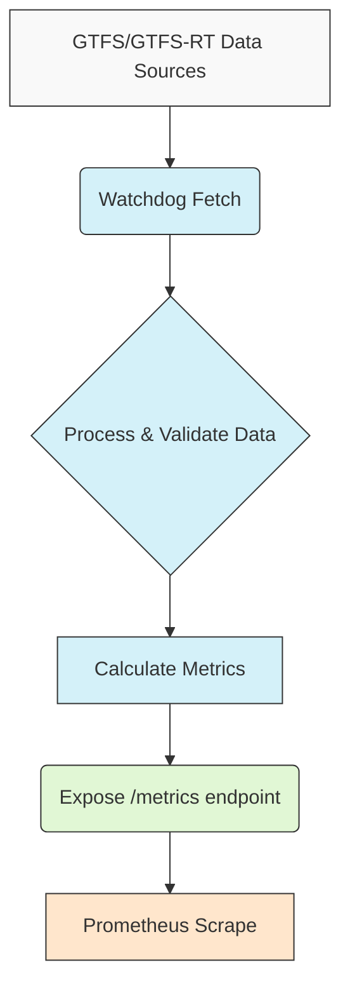

### 2.1. Current File Structure for Metrics

The core logic for metric collection and definition is organized across several files within the `internal/metrics/` directory:

| File                                     | Purpose                                                                       | Current Metric Coverage |
| :--------------------------------------- | :---------------------------------------------------------------------------- | :---------------------- |
| `internal/metrics/agencies_with_coverage.go` | Monitors transit agency data consistency between static GTFS and API endpoints. | Yes                     |
| `internal/metrics/bundle_expiration.go`    | Tracks expiration dates of GTFS schedule data bundles.                       | Yes                     |
| `internal/metrics/gtfs-realtime-bindings.go` | Verifies real-time vehicle position data between GTFS-RT feeds and APIs.    | Yes                     |
| `internal/metrics/metrics.go`            | Core file defining Prometheus metric objects and handling registration.      | (Defines metrics)       |
| `internal/metrics/server_ping.go`        | Monitors availability of the OneBusAway API servers via ping checks.         | Yes                     |
| `internal/models/models.go`              | Defines data structures used throughout the metrics system.                  | No (Potential future)   |
| `cmd/watchdog/main.go`                   | Main application entry point.                                                 | No (Future target)      |

### 2.2. Metrics Relationship Diagram

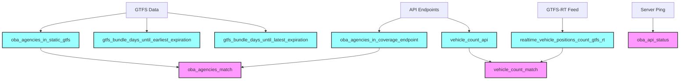

### Style Guide for Metric Types:
- <span style="background-color:#9ff;padding:2px 6px;border-radius:3px;">Gauge</span> - Value that can go up and down
- <span style="background-color:#f9f;padding:2px 6px;border-radius:3px;">Binary</span> - Binary gauge (0 or 1)
- <span style="background-color:#ff9;padding:2px 6px;border-radius:3px;">Counter</span> - Value that only increases

## 3. Detailed Metrics Reference

The following metrics are currently implemented in Watchdog.

### 3.1. Agency Monitoring Metrics

These metrics ensure consistent representation of transit agencies across data sources. Implemented in: `internal/metrics/agencies_with_coverage.go`.

---

#### **`oba_agencies_in_static_gtfs`**

* **Type:** `Gauge`
* **Stability:** Stable
* **Scrape Interval:** 5m
* **Description:** Tracks the total number of unique transit agencies found within the static GTFS data files.
* **Labels:**
    * `server_id`: The identifier of the OBA server instance being monitored.
* **Sample Output:**
```
# HELP oba_agencies_in_static_gtfs Number of agencies in static GTFS
# TYPE oba_agencies_in_static_gtfs gauge
oba_agencies_in_static_gtfs{server_id="sea"} 5
```
* **Alert Threshold Example:**
```promql
oba_agencies_in_static_gtfs < 3
```
* **Why it Matters / Use Cases:**
    * Monitors the completeness of static GTFS data. Unexpected changes can indicate missing agencies in updates, GTFS parsing issues, or incomplete feeds.
    * Example: If a region normally has 5 agencies and this metric drops to 4, it signals an immediate need to investigate which agency is missing.

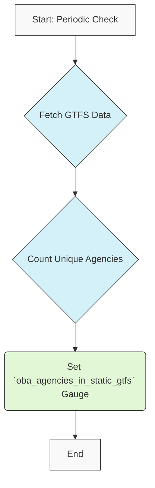

---

#### **`oba_agencies_in_coverage_endpoint`**

* **Type:** `Gauge`
* **Stability:** Stable
* **Scrape Interval:** 5m
* **Description:** Tracks the number of agencies reported by the OneBusAway API's `agencies-with-coverage` endpoint.
* **Labels:**
    * `server_id`: The identifier of the OBA server instance being monitored.
* **Sample Output:**
```
# HELP oba_agencies_in_coverage_endpoint Number of agencies reported by the API
# TYPE oba_agencies_in_coverage_endpoint gauge
oba_agencies_in_coverage_endpoint{server_id="sea"} 5
```
* **Alert Threshold Example:**
```promql
oba_agencies_in_coverage_endpoint < 3
```
* **Why it Matters / Use Cases:**
    * Verifies that the API accurately reflects the agencies present in the system.
    * Discrepancies compared to `oba_agencies_in_static_gtfs` can point to API configuration errors, data synchronization problems, or incomplete server deployments.
    * Helps confirm successful addition or removal of agencies during system updates.

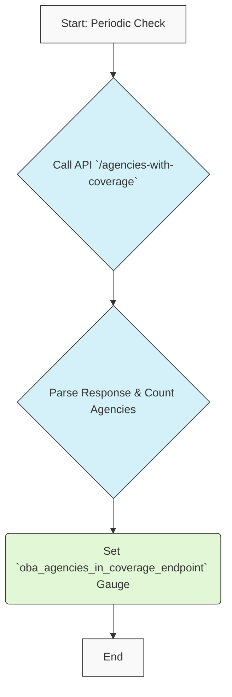

---

#### **`oba_agencies_match`**

* **Type:** `Gauge` (Binary: 0 or 1)
* **Stability:** Stable
* **Scrape Interval:** 5m
* **Description:** Indicates whether the agency count from the static GTFS (`oba_agencies_in_static_gtfs`) matches the count from the API's `agencies-with-coverage` endpoint (`oba_agencies_in_coverage_endpoint`).
    * `1`: Counts match.
    * `0`: Counts do not match.
* **Labels:**
    * `server_id`: The identifier of the OBA server instance being monitored.
* **Sample Output:**
```
# HELP oba_agencies_match Whether agency counts match between static GTFS and API
# TYPE oba_agencies_match gauge
oba_agencies_match{server_id="sea"} 1
```
* **Alert Threshold Example:**
```promql
oba_agencies_match == 0
```
* **Why it Matters / Use Cases:**
    * Directly flags inconsistencies between static data and the API, which could lead to missing transit options in apps or user confusion.
    * Essential for ensuring data integrity across the transit information ecosystem.

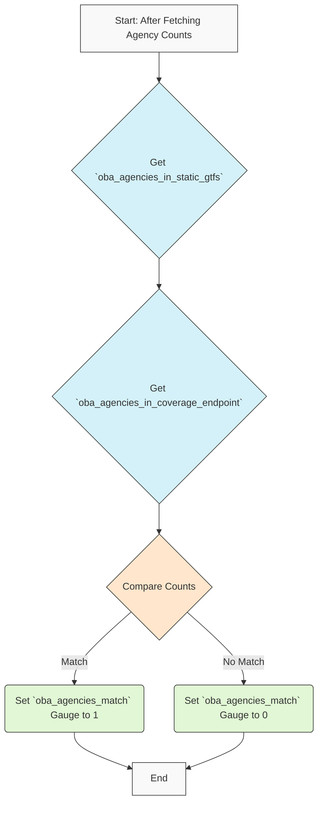

---

### 3.2. GTFS Bundle Expiration Metrics

These metrics monitor the validity period of transit schedule data. Implemented in: `internal/metrics/bundle_expiration.go`.

---

#### **`gtfs_bundle_days_until_earliest_expiration`**

* **Type:** `Gauge`
* **Stability:** Stable
* **Scrape Interval:** 1h
* **Description:** Tracks the number of days remaining until the *earliest* expiration date found among all service periods defined in the GTFS schedule bundle.
* **Labels:**
    * `server_id`: The identifier of the OBA server instance being monitored.
* **Sample Output:**
```
# HELP gtfs_bundle_days_until_earliest_expiration Days until earliest GTFS bundle expiration
# TYPE gtfs_bundle_days_until_earliest_expiration gauge
gtfs_bundle_days_until_earliest_expiration{server_id="sea"} 14
```
* **Alert Threshold Example:**
```promql
gtfs_bundle_days_until_earliest_expiration < 7
```
* **Why it Matters / Use Cases:**
    * Crucial for preventing service disruptions due to expired schedules. Riders might see outdated info, or trip planning might fail.
    * Acts as an early warning system. Agencies often need 2-4 weeks lead time for schedule updates, so low values trigger the update process.

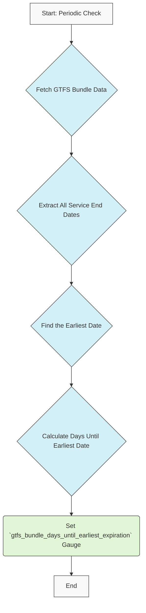

---

#### **`gtfs_bundle_days_until_latest_expiration`**

* **Type:** `Gauge`
* **Stability:** Stable
* **Scrape Interval:** 1h
* **Description:** Tracks the number of days remaining until the *latest* (furthest in the future) expiration date found within the GTFS schedule bundle.
* **Labels:**
    * `server_id`: The identifier of the OBA server instance being monitored.
* **Sample Output:**
```
# HELP gtfs_bundle_days_until_latest_expiration Days until latest GTFS bundle expiration
# TYPE gtfs_bundle_days_until_latest_expiration gauge
gtfs_bundle_days_until_latest_expiration{server_id="sea"} 120
```
* **Alert Threshold Example:**
```promql
gtfs_bundle_days_until_latest_expiration < 30
```
* **Why it Matters / Use Cases:**
    * Provides a complete picture of schedule validity, especially when different agencies or routes have varying update cycles.
    * Useful for long-term data planning and identifying schedules with unusually long or short validity periods.

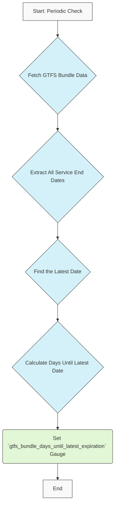

---

### 3.3. Real-time Vehicle Position Metrics

These metrics verify the flow and consistency of real-time vehicle location data. Implemented in: `internal/metrics/gtfs-realtime-bindings.go`.

---

#### **`realtime_vehicle_positions_count_gtfs_rt`**

* **Type:** `Gauge`
* **Stability:** Stable
* **Scrape Interval:** 1m
* **Description:** Tracks the number of distinct vehicles currently reporting positions in the monitored GTFS-Realtime (GTFS-RT) feed.
* **Labels:**
    * `gtfs_rt_url`: The URL of the specific GTFS-RT feed being monitored.
    * `server_id`: The identifier of the OBA server instance being monitored.
* **Sample Output:**
```
# HELP realtime_vehicle_positions_count_gtfs_rt Number of vehicles reporting positions in GTFS-RT feed
# TYPE realtime_vehicle_positions_count_gtfs_rt gauge
realtime_vehicle_positions_count_gtfs_rt{gtfs_rt_url="https://example.org/gtfs-rt/vehiclepositions",server_id="sea"} 142
```
* **Alert Threshold Example:**
```promql
realtime_vehicle_positions_count_gtfs_rt == 0 and hour() >= 6 and hour() < 22
```
* **Why it Matters / Use Cases:**
    * Monitors the health of the real-time data feed. Significant drops can indicate vehicle hardware failures (GPS/transmitters), feed processing issues, or network problems.
    * Provides operators insight into the operational status of their real-time tracking systems.

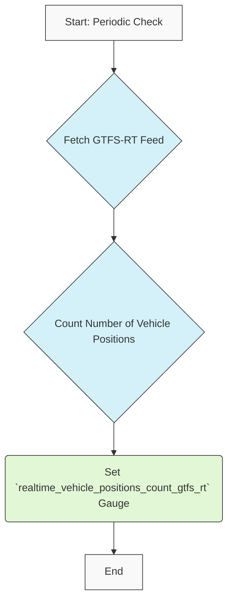

---

#### **`vehicle_count_api`**

* **Type:** `Gauge`
* **Stability:** Stable
* **Scrape Interval:** 1m
* **Description:** Tracks the number of vehicles reported by the OBA API, typically queried for a specific agency or the entire system.
* **Labels:**
    * `agency_id`: The ID of the transit agency being monitored (may be empty/all if querying system-wide).
    * `server_id`: The identifier of the OBA server instance being monitored.
* **Sample Output:**
```
# HELP vehicle_count_api Number of vehicles reported by the OBA API
# TYPE vehicle_count_api gauge
vehicle_count_api{agency_id="KCM",server_id="sea"} 110
vehicle_count_api{agency_id="ST",server_id="sea"} 32
```
* **Alert Threshold Example:**
```promql
vehicle_count_api{agency_id="KCM"} < 10 and hour() >= 6 and hour() < 22
```
* **Why it Matters / Use Cases:**
    * Monitors the availability of vehicle data through the primary API interface used by apps.
    * Allows comparison against the raw GTFS-RT feed count to check API processing. Differences can indicate API errors, filtering issues, or sync delays.

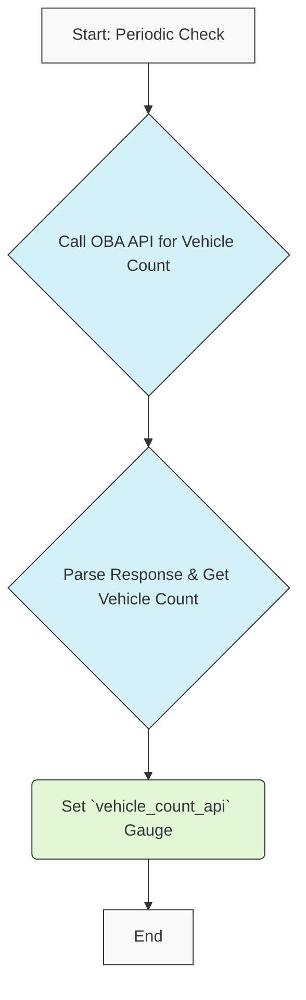

---

#### **`vehicle_count_match`**

* **Type:** `Gauge` (Binary: 0 or 1)
* **Stability:** Stable
* **Scrape Interval:** 1m
* **Description:** Indicates whether the vehicle count from the GTFS-RT feed matches the count reported by the API for a given scope (e.g., per agency).
    * `1`: Counts match (within tolerance/logic).
    * `0`: Counts do not match.
* **Labels:**
    * `agency_id`: The ID of the agency being compared.
    * `server_id`: The identifier of the OBA server instance being monitored.
* **Sample Output:**
```
# HELP vehicle_count_match Whether vehicle counts between GTFS-RT and API match
# TYPE vehicle_count_match gauge
vehicle_count_match{agency_id="KCM",server_id="sea"} 1
```
* **Alert Threshold Example:**
```promql
vehicle_count_match == 0 for 5m
```
* **Why it Matters / Use Cases:**
    * Ensures consistency between the raw real-time feed and the API output.
    * Inconsistent counts can lead to riders seeing different vehicle locations or availability depending on the app they use.

#### Implementation Notes for `vehicle_count_match`

This metric compares counts from two different systems that may not be perfectly synchronized. Consider:

1. **Time Window Alignment**: GTFS-RT feeds and API responses may have different refresh rates. The comparison should use a tolerance window (±30 seconds recommended).
2. **Count Tolerance**: Small discrepancies (±5%) may be normal due to vehicles entering/leaving service at boundaries of measurement periods.
3. **Agency Filtering**: Ensure agency IDs are consistent between data sources.

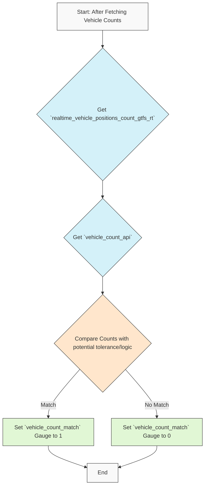

---

### 3.4. System Health Metrics

This category monitors the basic availability of the OBA system. Implemented in: `internal/metrics/server_ping.go`.

---

#### **`oba_api_status`**

* **Type:** `Gauge` (Binary: 0 or 1)
* **Stability:** Stable
* **Scrape Interval:** 30s
* **Description:** Indicates whether the monitored OneBusAway API server is responding successfully to basic health checks (e.g., pinging a known endpoint).
    * `1`: Server is up and responding.
    * `0`: Server is down or not responding correctly.
* **Labels:**
    * `server_id`: The identifier of the OBA server instance being monitored.
    * `server_url`: The base URL of the OBA server being monitored.
* **Sample Output:**
```
# HELP oba_api_status Status of the OBA API server (1=up, 0=down)
# TYPE oba_api_status gauge
oba_api_status{server_id="sea",server_url="https://api.pugetsound.onebusaway.org"} 1
```
* **Alert Threshold Example:**
```promql
oba_api_status == 0 for 2m
```
* **Why it Matters / Use Cases:**
    * Fundamental check for API availability. If this metric is 0, most other data checks are likely to fail.
    * Often the first metric checked when troubleshooting system-wide outages affecting trip planners or real-time apps.

#### Implementation Notes for `oba_api_status`

1. **Timeouts**: The ping check uses a 5-second timeout to determine if the server is responsive.
2. **Health Endpoint**: The check targets the `/api/where/agencies-with-coverage.json` endpoint as it's lightweight and fundamental.

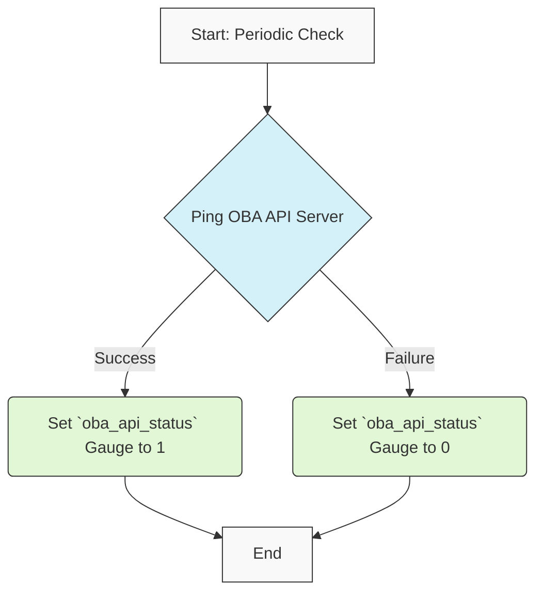

---

## 4. Metrics Yet To Be Implemented

The following metrics are prioritized for implementation:

### P0 (Critical)

#### **`watchdog_cpu_usage_percent`** (System Performance)
* **Type:** `Gauge`
* **Description:** Current CPU usage percentage of the Watchdog process.
* **Implementation Example:**
```go
cpuUsage := prometheus.NewGauge(prometheus.GaugeOpts{
    Name: "watchdog_cpu_usage_percent",
    Help: "Current CPU usage percentage of Watchdog process",
})
prometheus.MustRegister(cpuUsage)
```
* **Target File:** `cmd/watchdog/main.go`

#### **`gtfs_rt_validation_errors`** (Data Quality)
* **Type:** `Counter`
* **Description:** Count of GTFS-RT validation rule failures by error type.
* **Labels:**
    * `feed_url`: The URL of the GTFS-RT feed
    * `error_type`: The specific validation rule that failed
* **Target File:** New file: `internal/metrics/gtfs_validation.go`

### P1 (Important)

#### **`watchdog_memory_usage_mb`** (System Performance)
* **Type:** `Gauge`
* **Description:** Current memory usage of the Watchdog process in MB.
* **Target File:** `cmd/watchdog/main.go`

#### **`gtfs_rt_feed_fetch_duration_seconds`** (Performance)
* **Type:** `Histogram`
* **Description:** Time taken to fetch and process GTFS-RT feeds.
* **Labels:**
    * `feed_url`: The URL of the GTFS-RT feed
* **Target File:** `internal/metrics/gtfs-realtime-bindings.go`

### P2 (Nice to Have)

#### **`watchdog_uptime_seconds`** (System Health)
* **Type:** `Counter`
* **Description:** Total time in seconds that Watchdog has been running.
* **Target File:** `cmd/watchdog/main.go`

#### **`gtfs_static_agency_trip_count`** (Data Quality)
* **Type:** `Gauge`
* **Description:** Number of trips defined per agency in static GTFS.
* **Labels:**
    * `agency_id`: Agency identifier
    * `server_id`: OBA server identifier
* **Target File:** New file: `internal/metrics/gtfs_structure.go`

## 5. Contributing New Metrics

Follow these steps to add a new metric to Watchdog:

1. **Choose the appropriate metric type:**
   - `Gauge`: For values that go up and down (e.g., vehicle counts)
   - `Counter`: For cumulative counts that only increase (e.g., error counts)
   - `Histogram`: For measuring distributions of values (e.g., API response times)

2. **Define the metric in `internal/metrics/metrics.go`:**
   ```go
   var NewMetricName = prometheus.NewGauge(prometheus.GaugeOpts{
       Name: "metric_name_with_namespace",
       Help: "Clear description of what this metric measures",
   })
   ```

3. **Register the metric in the `init()` function:**
   ```go
   func init() {
       prometheus.MustRegister(NewMetricName)
   }
   ```

4. **Implement collection logic in the relevant file**
   - Use the standard error handling pattern
   - Document any potential failure modes

5. **Add tests in `internal/metrics/metrics_test.go`**
   - Test both normal operation and error conditions
   - Mock external dependencies

6. **Update this documentation:**
   - Add the metric using the standard template
   - Include example output and alert thresholds

### Cardinality Considerations

When adding metrics that use labels, consider cardinality (the number of unique label value combinations):

- **High-cardinality labels** (e.g., trip_id, vehicle_id) should be used sparingly and only when necessary
- **Medium-cardinality labels** (e.g., route_id) should be monitored for growth
- **Low-cardinality labels** (e.g., agency_id, server_id) are generally safe

Example of problematic high-cardinality metric:
```go
// DON'T DO THIS - would create thousands of time series
vehicleDelayGauge := prometheus.NewGaugeVec(
    prometheus.GaugeOpts{
        Name: "vehicle_delay_seconds",
        Help: "Vehicle delay in seconds",
    },
    []string{"vehicle_id", "trip_id", "stop_id"}, // Too many combinations!
)
```

Better approach:
```go
// DO THIS INSTEAD - aggregate to reduce cardinality
vehicleDelayGauge := prometheus.NewGaugeVec(
    prometheus.GaugeOpts{
        Name: "vehicle_delay_seconds_by_route",
        Help: "Average vehicle delay in seconds by route",
    },
    []string{"route_id", "agency_id"}, // Much lower cardinality
)
```

## 6. Appendix


### Glossary

- **GTFS:** General Transit Feed Specification - A standardized format for public transportation schedules and associated geographic information.
- **GTFS-RT:** GTFS-Realtime - An extension to GTFS that provides real-time updates about transit fleets.
- **OBA:** OneBusAway - An open-source platform for real-time transit information.
- **Bundle:** A collection of GTFS data files that have been processed and loaded into the OneBusAway system.
- **Gauge:** A Prometheus metric type that represents a value that can increase or decrease over time.
- **Counter:** A Prometheus metric type that represents a cumulative count that only increases.
- **Histogram:** A Prometheus metric type that samples observations and counts them in configurable buckets.
- **Cardinality:** The number of unique time series generated by a metric with its label combinations.
- **SLA:** Service Level Agreement - A commitment between a service provider and client about aspects of the service such as quality and availability.
- **Feed:** A data source providing transit information, either static (GTFS) or real-time (GTFS-RT).
